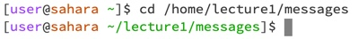
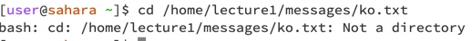
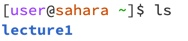
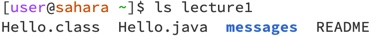
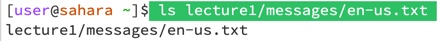
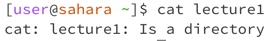
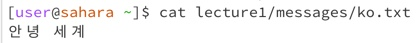

# Lab Report 1

## `cd` command

1) `cd`

The working directory was home and I got this output because there was no need to change the directory because I was already at home. There are no errors.

2) `cd lecture1` 

The working directory was /lecture1/messages and I got this output because I changed the directory from home into lecture and into messages. There are no errors.

3) `cd /home/lecture1/messages/ko.txt`

The working directory is /home/lecture1/messages/ko.txt and I got no directory because I changed the directory into a file called ko.txt which is a file and not a a directory. There is an error because the file is not a directory.

## `ls` command

1) `ls`

The working directory is home because the list of options from home is only the lecture1 directory. There is no error.

2) `ls lecture1`

The working directory is home because I did not change the directory rather just asked the compiler to provide a list. There is no error.

3) `ls lecture1/messages/en-us.txt`

The working directory is home because I did not change the directory rather just asked the compiler to provide a list. There is no error.

## `cat` command

1) `cat`

The working directory is home because it does not change the directory and I got no output because there is nothing to be shown with just cat. There is no error message. 

2) `cat lecture1`

The working directory is home because it does not change the directory and I got the output because it shows that lecture1 is a directory and not a file. There is an error message because cat prints out whatever solution there is in the code but it shows that lecture1 is just a directory.

3) `cat lecture1/messages/ko.txt`

The working directory is home because it does not change the directory and I got the output because it shows that hello world in Korean is translated to the output I got. There is no error message.
