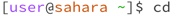
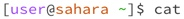

#Lab Report 1

## `cd` command

1) `cd`

2) `cd/lecture1` 

3) `cd /home/lecture1/messages/ko.txt`

## `ls` command

1) `ls`

2) `ls lecture1`

3) `ls lecture1/messages/en-us.txt`

## `cat` command

1) `cat`

2) `cat lecture1`

3) `cat lecture1/messages/ko.txt`

